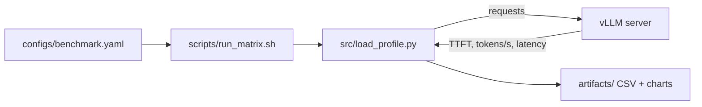

# UltraLlama

Production serving benchmark project using vLLM.

## Objective

Benchmark and optimize LLM serving with focus on:
- Throughput (tokens/sec)
- Latency (TTFT + per-token latency)
- Concurrency behavior

## Scope

- vLLM baseline server setup
- Load profile runner (single-user + concurrent)
- Compare serving settings and summarize tradeoffs

## Architecture



## Quick Start

```bash
python3 -m venv .venv
source .venv/bin/activate
pip install -r requirements.txt
python -m src.load_profile --users 1 --requests 20
```
